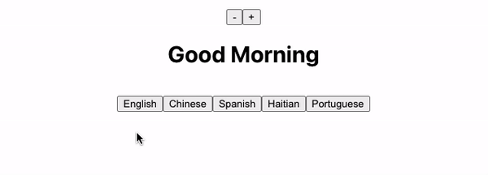

# Question

Take a look at the demo of the app that you must build in the coding portion. Describe a potential component hierarchy for this application using a bulleted list. Demonstrate parent-child component relationships using indented bullets.

See below where we've given you a template to start working with

# Answer

- App
  - component1
    - child1
    - child2
  - component2
    - child1
    - child2
      - grandchild1

# Teacher Feedback